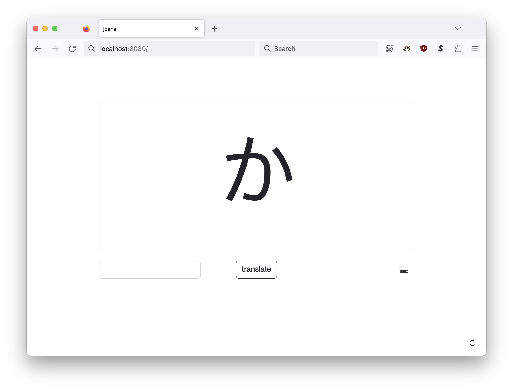
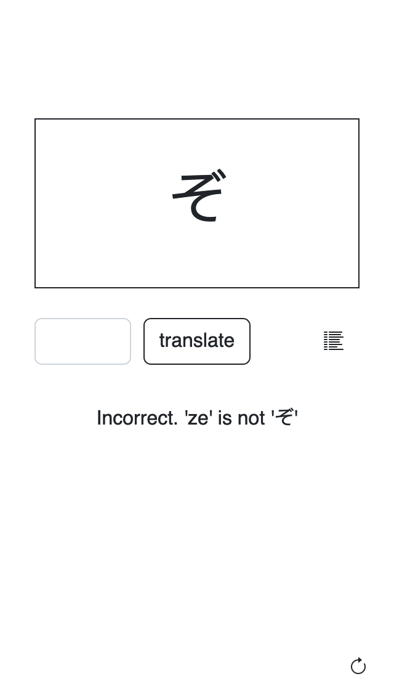
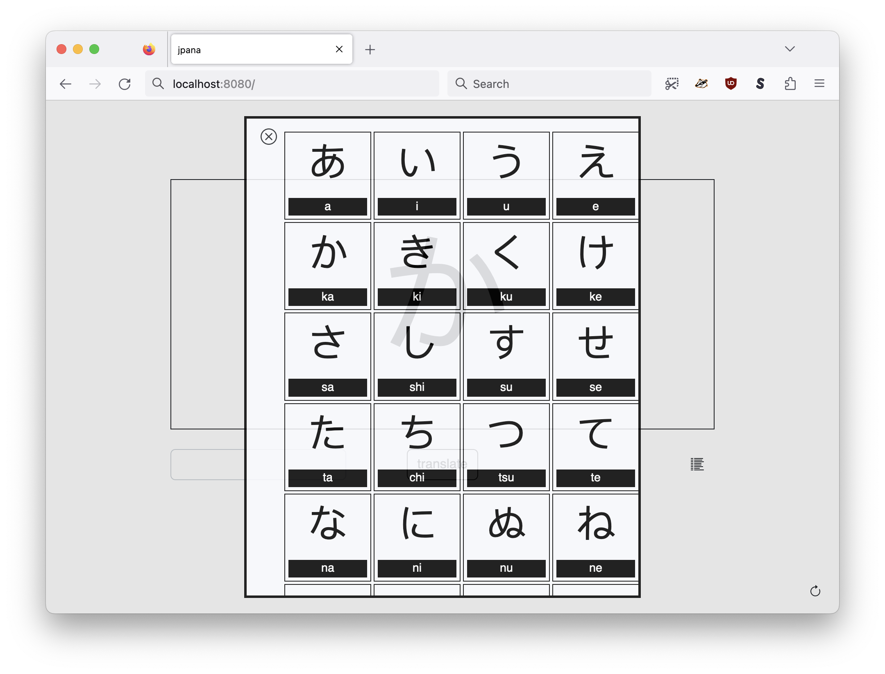
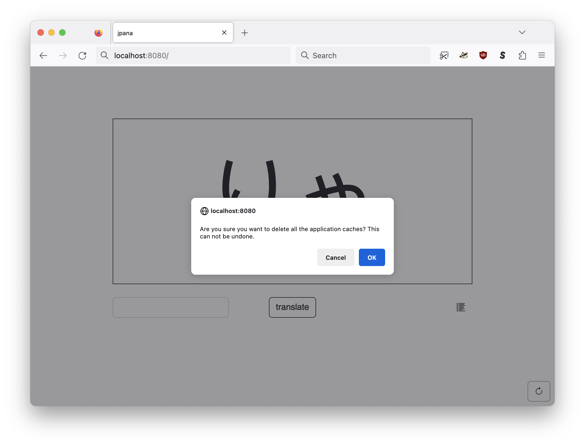

# jpana

There are many "flashcard" web applications for memorizing Hirigana (and eventually Katakana). This one is mine.

## Motivation

This application was inspired by Phil Gyford's [Hirigana and Katakana quiz](https://www.gyford.com/japanese/) which is very good. I wanted something like that but with a few differences:

* I did not want a progress or score counter
* I wanted a built-in lookup table, or chart, of characters
* I wanted a skip this character button
* I wanted an application that could work offline

So, that's what `jpana` does.

## Why is it called "jpana" ?

Mostly because I didn't spend much time thinking about a name. Both hirigana and katakana end in "ana" and "jp" is the abbreviation for Japan, so "jp" + "ana" = "jpana". Also, it's a mis-spelling of "japan" but that was just a coincidence.

## Screenshots

### Basic layout

The basic layout consists of a single Hirigana character rendered in a large font size. Underneath the character is an input field to enter in the English phoneme corresponding to that character followed by a submit button. To the right of the submit button is a "list" icon which will open a modal dialog listing all the Hirigana characters and their English phonemes.

In the bottom right-hand corner of the page is a "refresh" icon which will load a new Hirigana character. If the "refresh" icon is double-click a confirmation window will be opened that, if agreed to, will purge any offline cache data for the application.

### A correct guess

### An incorrect guess

### The lookup chart of all Hirigana characters and their English phonemes

### Purging offline caches

## See also

* https://www.gyford.com/japanese/
